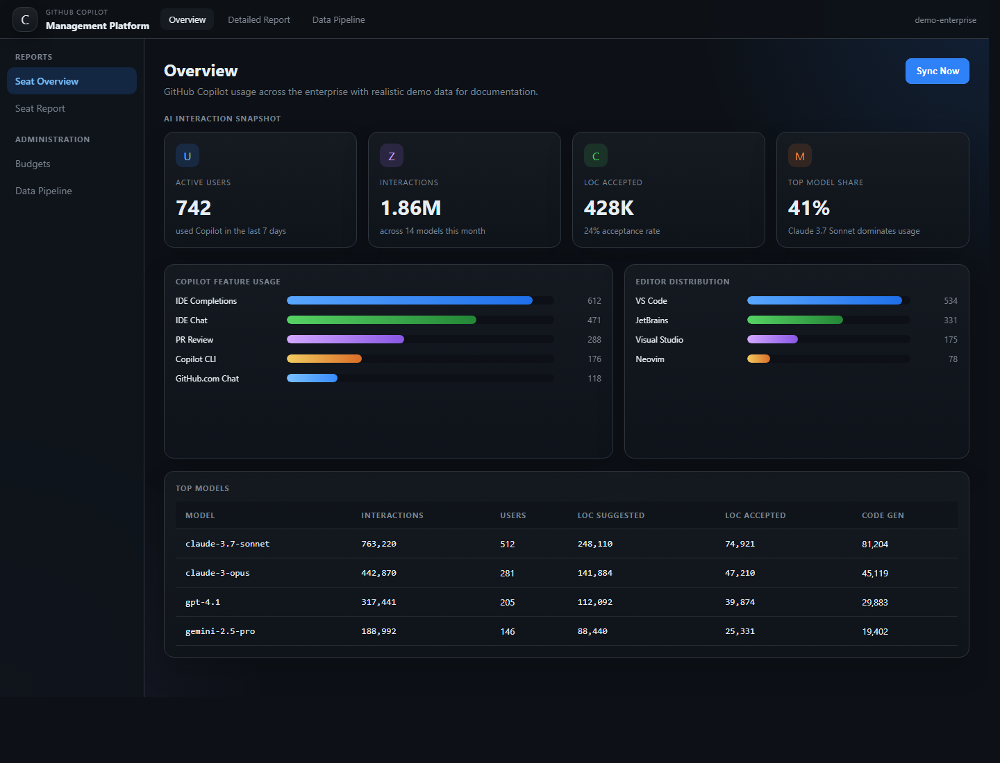
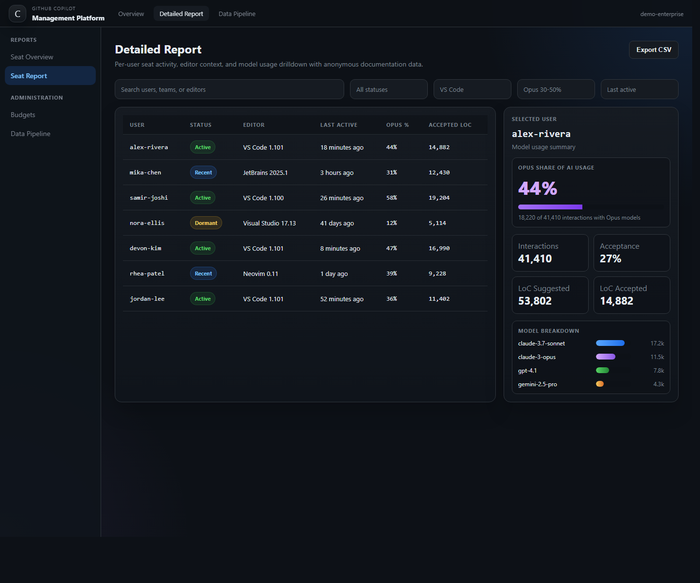
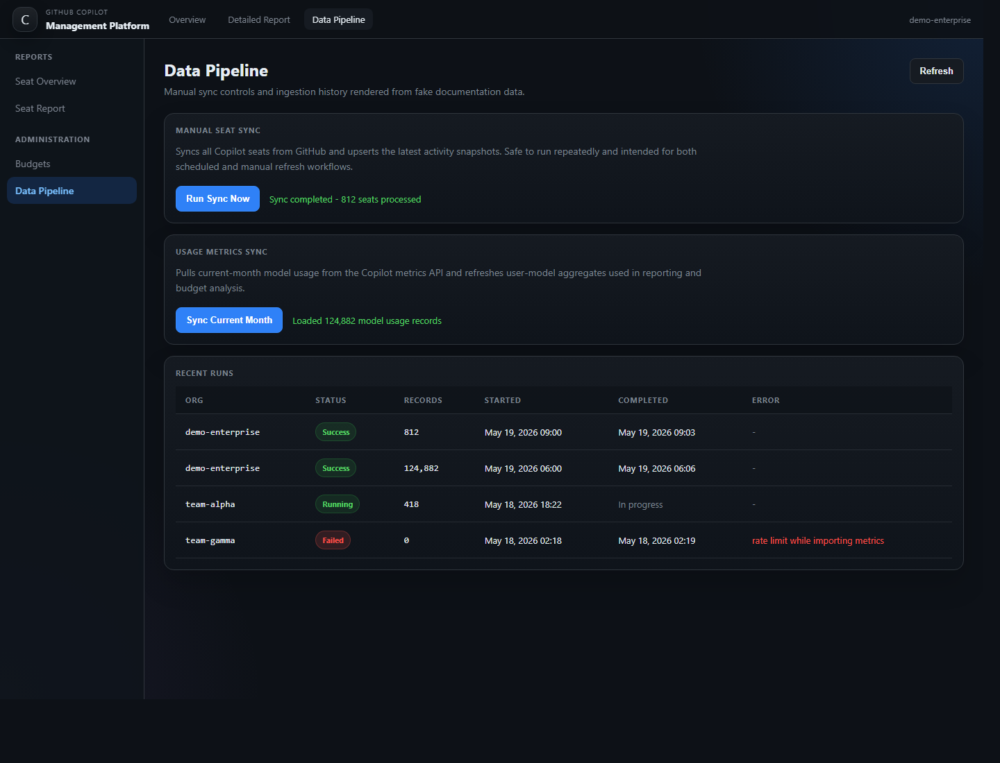
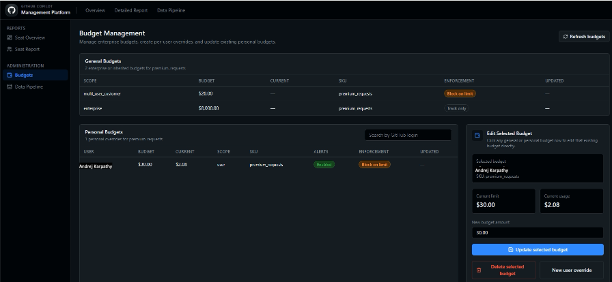

# GitHub Copilot Management Platform

GitHub Copilot Management Platform is an administrative dashboard for enterprises that need clear visibility into GitHub Copilot usage and practical controls for Copilot budget management.

It brings usage monitoring, seat activity reporting, model mix analysis, ingestion operations, and budget workflows into a single interface designed for platform teams, engineering leadership, and internal operations owners.

## What It Delivers

### Usage Monitoring

- Track overall seat allocation and recent activity across the enterprise
- Monitor AI interaction volume, active users, and code suggestion acceptance trends
- Analyze model usage by interaction count, user reach, and code generation impact
- Review editor distribution and Copilot feature usage patterns
- Drill into per-user activity to identify dormant seats, heavy usage, and model preferences

### Copilot Budget Management

- View enterprise-level and inherited Copilot budgets in one place
- Manage personal budget overrides for individual users
- Apply team budget updates across GitHub teams
- Distinguish between track-only budgets and enforced limits that prevent further usage
- Support operational workflows for budget reviews, exception handling, and targeted controls

### Operational Oversight

- Trigger ingestion runs on demand
- Review ingestion health and recent sync history
- Use a backend API and Prisma data model that can be extended for internal needs
- Run in demo mode for evaluation without live GitHub enterprise credentials

## Core Capabilities

| Area | Capability |
|---|---|
| Executive visibility | Enterprise summary for seats, activity, and adoption trends |
| User analytics | Detailed per-user reporting with filters and model breakdowns |
| Model governance | Monitoring of model mix, interaction share, and usage intensity |
| Budget controls | Enterprise, team, and user-level Copilot budget workflows |
| Operations | Ingestion triggers, sync history, and troubleshooting support |

## Screenshots

### Overview



### Detailed Report



### Data Pipeline



### Budget Management



## Architecture

```text
GitHub Enterprise APIs
         |
         v
Ingestion Worker
         |
         v
PostgreSQL via Prisma
         |
         v
Express API
         |
         v
React Dashboard
```

## Technology Stack

- Frontend: React, Vite, TypeScript, Tailwind, Recharts
- Backend: Node.js, Express, TypeScript, Prisma
- Database: PostgreSQL
- Scheduling: node-cron

## Quick Start

### Docker

```bash
cp .env.example .env
docker-compose up -d
```

Open http://localhost.

### Local Development

Prerequisites:

- Node.js 20+
- PostgreSQL 14+
- npm

Install dependencies:

```bash
npm install
```

Create local configuration:

```bash
cp .env.example .env
```

Initialize the database:

```bash
docker-compose up -d postgres
npm run db:push
```

Run the platform:

```bash
npm run dev
```

- Frontend: http://localhost:5173
- Backend: http://localhost:3001

## Configuration

The main configuration lives in `.env`. Start from [.env.example](.env.example).

Common settings:

- `DEMO_MODE=true` enables demo-friendly flows without live enterprise data
- `GITHUB_TOKEN` supplies GitHub API access for ingestion and budget operations
- `GITHUB_ENTERPRISE_SLUG` identifies the GitHub enterprise shown in the UI
- `GITHUB_ORG` or `GITHUB_ORGS` can be used for single-org or multi-org setups
- `DATABASE_URL` points Prisma to PostgreSQL

## Live GitHub Integration

To connect the platform to real enterprise data:

1. Create a GitHub App or fine-grained PAT with the required enterprise Copilot permissions.
2. Set the following in `.env`:

```env
DEMO_MODE=false
GITHUB_TOKEN=your_token
GITHUB_ENTERPRISE_SLUG=your-enterprise-slug
```

3. Restart the backend so startup sync and scheduled ingestion pick up the new configuration.

## Data Model

Key tables:

| Table | Purpose |
|---|---|
| `ingestion_runs` | Tracks each seat sync or usage ingestion run |
| `raw_reports` | Stores raw payloads for troubleshooting and auditability |
| `copilot_usage_daily_user_model` | Stores normalized per-user, per-model usage facts |

## API Surface

Representative endpoints:

| Method | Path | Description |
|---|---|---|
| GET | `/api/copilot/config` | UI-safe runtime config such as enterprise slug |
| GET | `/api/copilot/summary` | Aggregate seat and activity summary |
| GET | `/api/copilot/seats` | Paginated seat report |
| GET | `/api/copilot/model-usage/summary` | Aggregate model usage metrics |
| GET | `/api/copilot/ingestion-runs` | Recent ingestion history |
| POST | `/api/copilot/ingest` | Trigger seat ingestion |
| POST | `/api/copilot/model-usage/import` | Trigger model usage sync |

## Open Source

- License: [MIT](LICENSE)
- Contributing guide: [CONTRIBUTING.md](CONTRIBUTING.md)

## Notes

Screenshots in this repository intentionally use fake data.

## Roadmap

- Scheduled report delivery and export workflows
- Alerting for usage anomalies and budget thresholds
- Additional governance views and audit-focused reporting
- Production hardening and deployment guidance
